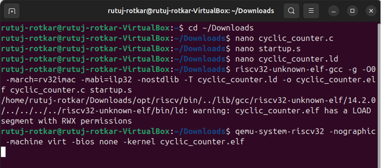
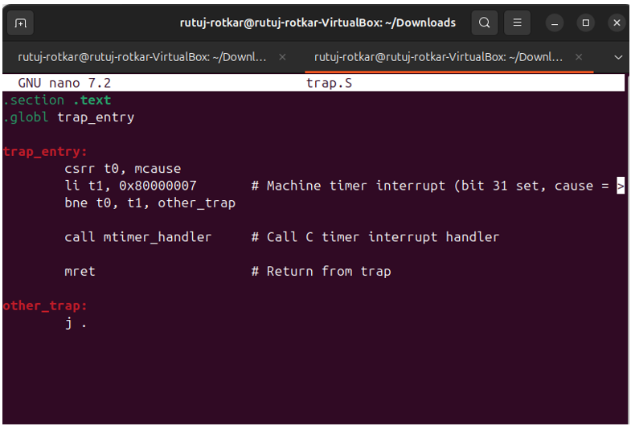

# vsdRiscSoc
# Week 1 – RISC-V Bare-Metal: Toolchain, Compilation, and Core Concepts

Welcome! This week is all about setting up your RISC-V toolchain, writing and compiling your first bare-metal programs, and understanding the basics of how things work under the hood. Each task below is practical, beginner-friendly, and relevant for VLSI and embedded enthusiasts.

---

## Task 1: Toolchain Setup & Check

*Set up the RISC-V GCC toolchain and verify it’s working.*

**Commands:**  
```
tar -xzf riscv-toolchain-rv32imac-x86_64-ubuntu.tar.gz  
nano ~/.bashrc
export PATH="/home/rutuj-rotkar/Downloads/opt/riscv/bin:$PATH"  
source ~/.bashrc  
riscv32-unknown-elf-gcc --version
riscv32-unknown-elf-objdump --version
riscv32-unknown-elf-gdb --version
```
**Output:**


## Task 2: Hello, RISC-V!
*Write and compile your first C program for RISC-V.*

**Code:**
```c
#include 
int main() {
    volatile int counter = 0;
    counter = 42;
    int value =counter;
    return 0;
}
```
**Commands:**  
```
nano hello1.c
riscv32-unknown-elf-gcc -o hello1.elf hello1.c 
file hello1.elf
```
**Output**


## Task 3: C to Assembly
*See what your C code looks like as assembly.*

**Commands:**  
```
riscv32-unknown-elf-gcc -S -O0 hello1.c
nano hello1.s
```
**Output**


## Task 4: ELF to HEX & Disassembly
*Convert your program to HEX and disassemble it.*

**Commands:**  
```
riscv32-unknown-elf-objdump -d hello1.elf > hello1.dump
riscv32-unknown-elf-objcopy -O ihex hello1.elf hello1.hex
nano hello1.dump
nano hello1.hex
```
**Output**


## Task 5: RISC-V Register Quick Reference
*Cheat-sheet for the main RISC-V registers:*

| ABI Name | Register | Use                   |
|----------|----------|----------------------|
| zero     | x0       | Always zero          |
| ra       | x1       | Return address       |
| sp       | x2       | Stack pointer        |
| gp       | x3       | Global pointer       |
| tp       | x4       | Thread pointer       |
| t0–t6    | x5–x7, x28–x31 | Temporaries|
| s0–s11   | x8–x9, x18–x27 | Saved regs |
| a0–a7    | x10–x17  | Args/return values   |

## Task 6: Debugging with GDB
*Step through your code and inspect registers.*

**Commands:** 
```
riscv32-unknown-elf-gcc -march=rv32i -mabi=ilp32 -nostdlib -o hello2.elf hello2.c
riscv32-unknown-elf-gdb hello2.elf  
```

**GDB Commands:** 
```
target sim
load  
break main  
run
```
**Output**


## Task 7: Run on QEMU or Spike
*Try your program in an emulator.*

**Code:**
```c
#define UART0 0x10000000
void uart_putc(char c){
    *(volatile char *)UART0 = c;
}
void uart_puts(const char *s){
    while(*s) uart_putc(*s++);
}
int main(){
    uart_puts("Printing from UART\n");
    uart_puts("Value of x: 43\n");
    while(1);
}
```
**Commands:**
```
nano hello3.c
riscv32-unknown-elf-readelf -h hello3.elf
riscv32-unknown-elf-readelf -l hello3.elf
qemu-system-riscv32\ -nographic\ -machine virt \-bios none\ -krenel hello3.elf
```
**Output**


## Task 8: Compiler Optimizations
*Compare unoptimized and optimized assembly.*
**Code:**
```c
int add(int x, int y){
    return x + y;
}
int main(){
    volatile int result = add(3,4);
    return 0;
}
```
**Commands:**  
```
riscv32-unknown-elf-gcc -S -O0 hello.c -o hello_O0.s  
riscv32-unknown-elf-gcc -S -O2 hello.c -o hello_O2.s 
```
**Output**


## Task 9: Inline Assembly – Reading the Cycle Counter
*How to access low-level hardware counters in C.*

**Code:**
```c
static inline uint32_t rdcycle(void) {
    uint32_t c;
    __asm__ volatile ("csrr %0, cycle" : "=r"(c));
    return c;
}
```
**Commands:**
``` 
nano cyclic_counter.c
nano startup.s
nano cyclic_counter.ld
riscv32-unknown-elf-gcc -g O0 -march=rv32imac -mabi=ilp32 -nostdlib -T cyclic_counter.ld -o cyclic_counter.elf cyclic_counter.c startup.s
qemu-system-riscv32 -nographic -machine virt -bios none -kernel cyclic_counter.elf
```
**Output**




## Task 10: Memory-Mapped I/O (GPIO Toggle)
*Write directly to a hardware register.*

**Code:**
```c
int main(){
volatile int counter = 0;
counter = 42;
int value = counter;
return 0;
}
```
**Output**


## Task 11: Minimal Linker Script
*Tell the linker where to put your code and data.*

**Code:**
```ld
SECTIONS {
    .text 0x00000000 : { *(.text*) *(.rodata*)}
    .data 0x10000000 : { *(.data*) }
    .bss (NOLOAD) : { *(.bss*) *(COMMON)}
}
```
**Output**


## Task 12: What is crt0?
*crt0.S is the tiny bit of assembly that runs before your main function.  
It sets up the stack, clears memory, and then jumps to your C code.*

**Commands:**
``` 
nano toggle.c
riscv32-unknown-elf-gcc -march=rv32imac -mabi=ilp32 -nostdlib -o toggle.elf toggle.c
nano linker.ld
riscv32-unknown-elf-gcc -T linker.ld nostdlib -march=rv32imc -mabi=ilp32 -o hello3.elf hello3.c
```
**Output**


## Task 13: Timer Interrupts
*Enable and handle the machine-timer interrupt (MTIP).  
Write to the timer registers (`mtimecmp`), enable interrupts (`mie`, `mstatus`), and write a simple interrupt handler in C or assembly.*

**Commands:**
```
nano 13.c
nano trap.S
riscv32-unknown-elf-gcc -march=rv32imczicsr -mabi=ilp32 -nostartfiles -T linker.ld 13.c trap.S -o 13.elf
```
**Output**



## Task 14: What’s the "A" in rv32imac? 
Instructions like `lr.w`, `sc.w`, `amoadd.w`, `amoswap.w`, etc. used for safe concurrent memory access.
The ‘A’ (Atomic) extension in RV32IMAC introduces instructions that support atomic read-modify-write operations. These operations are essential in systems where multiple execution threads or processor cores might access and modify the same memory location at the same time. Without atomic instructions, such shared access could lead to race conditions, incorrect program behavior, or system crashes.

The extension adds several key instructions:
lr.w (Load Reserved): Loads a word from memory and marks it for exclusive access.

sc.w (Store Conditional): Attempts to store a word to memory only if no other core or thread has modified it since the corresponding lr.w.

amoswap.w: Atomically swaps a value in a register with a value in memory.

amoadd.w: Atomically adds a value to a memory location.

amoor.w, amoand.w, amoxor.w: Perform atomic bitwise OR, AND, and XOR on memory.

amomin.w, amomax.w, amominu.w, amomaxu.w: Perform atomic min/max operations (signed and unsigned) on memory.

These instructions are particularly useful for implementing synchronization mechanisms such as spinlocks, mutexes, and semaphores. They allow multiple cores or threads to coordinate without the need for disabling interrupts or using complex software-based locking methods. This is important in both operating system kernels and user-level applications that require thread-safe access to shared data.


## Task 15: Atomic Test Program
*Write a simple C program using atomic operations (or simulate with a spinlock).*
**Output**


## Task 16: printf with No OS (Newlib)
*Redirect `printf` output to UART by implementing `_write`.*

**Code:**
```c
int _write(int fd, char* buf, int len) {
    for (int i = 0; i < len; i++)
        *(volatile char*)UART0 = buf[i];
    return len;
}
```
*Compile with `-nostartfiles` and link your custom `syscalls.c`.*
**Output**


## Task 17: Endianness Check
*Check if your system is little-endian.*

**Code:**
```c
#include <stdio.h>
#include<stdint.h>
int main(){
    union {
      uint32_t value;
      uint32_t bytes[4];
      }test;
    test.value = 0x01020304;
    printf("Byte order: %02x %02x %02x %02x\n");
    return 0;
}
```
**Commands:**
```
qemu-riscv32 ./endian.elf
```
**Output**

